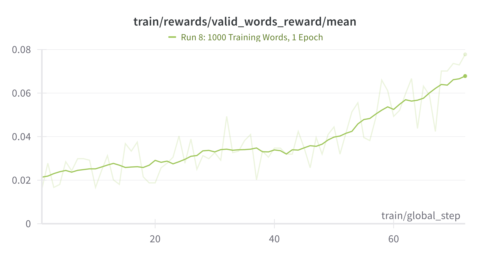
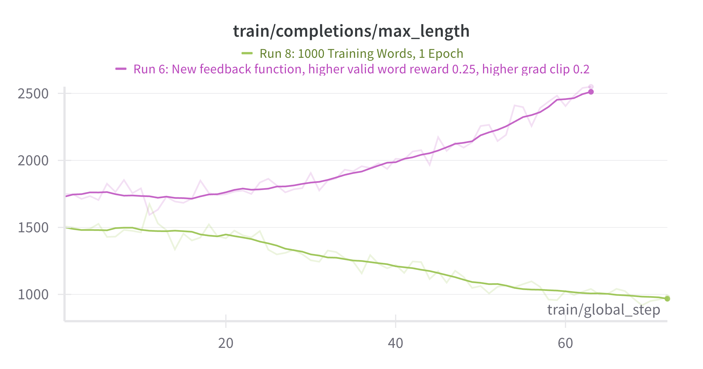
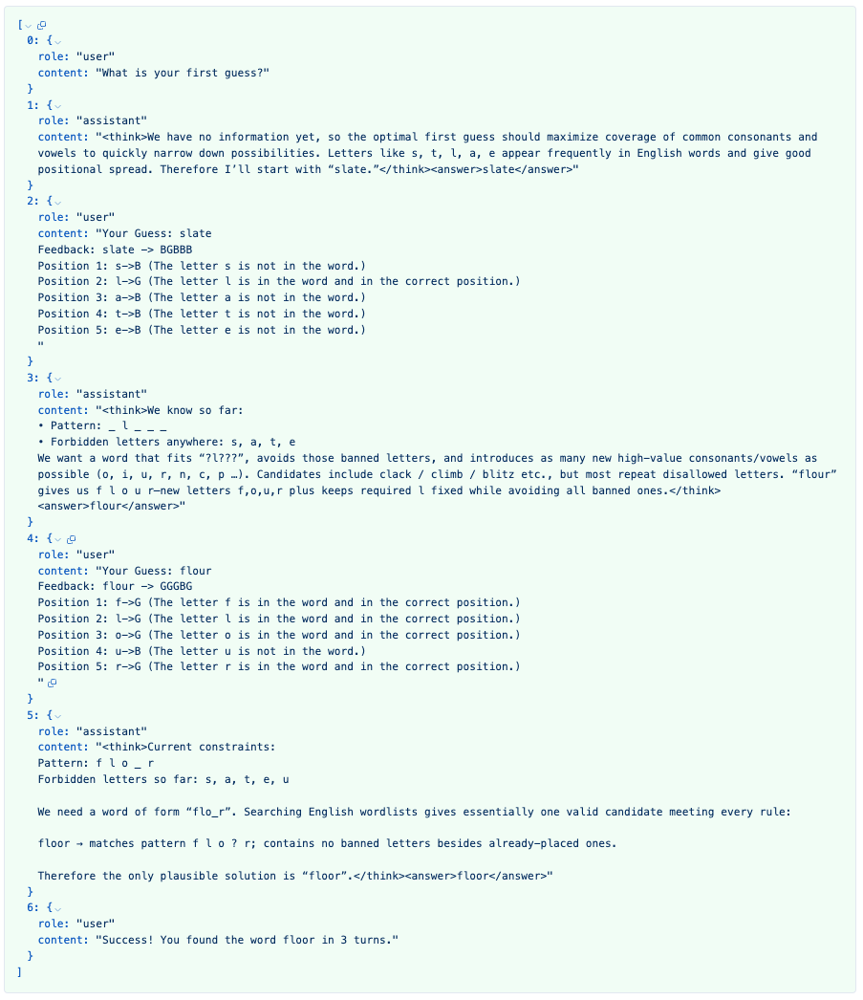

# Wordle-GRPO - [A $100 Agent](https://www.rldiary.com/p/the-100-agents)

## **Experience the magic of Reinforcement Learning for $100.**

Wordle-GRPO is a reinforcement learning training loop built on top of **Transformers, TRL, and Accelerate**, specifically designed to train language models to play the game of **Wordle** using a variation of the **GRPO (Group Relative Policy Optimization)** algorithm. The training pipeline is built for **multi-turn environments** like Wordle, where models learn from rewards defined by a custom rubric and iteratively refine their response.

# 🚀 Results from RL Loop

The base model Qwen2.5-7B-Instruct is first supervise finetuned with 500 traces generated by o3 using LoRA ($35 worth of API calls). The baseline game completion rates of this supervised finetuned model is less than 5%.

The model is then reinforcement tuned witha variation of GRPO - The best training run increases the performance of the supervised fine-tuned model by **3X** from 4.5% game solve rate to **14.5%** demonstrating a full 10% improvement after 35 steps - equal to about 6120 games (Each step involves 16 words (16 gradient accumulation steps) = 510 words, each 12 times = 6,120 games ). This roughly corresponds to 5 hours of training time with 3 x A100s = $25 of training compute at current prices (14 July 2025)


One of the persistent issues we faced with Qwen-2.5-7B SFT was the model *VERY* often produced guesses that were neither 5 letters long, nor valid english words. So the training loop included a valid word reward. This chart shows the model consistently getting better in learning to only use valid words, while slowly, but consistently improving upon game completion rates.



## Token Length Adaptation

**STUNNINGLY**, the model learns to adapt completion token lengths to different reward signals. Two divergent runs shown here with the completions max length. The purple line shows model adaption to cumulative rewards (Each criteria is evaluated separately and rewards are added together - Final Reward =  R1 + R2 + R3) vs. the orange line shows progressive rewards (Reward 1 for critria 1 achievement, Reward 2 for criteria 1 & 2 achievement, Reward 3 for criteria 1, 2 & 3 achievement). The core insight here is that the model learns that over-thinking causes it to often get the valid word reward wrong. So it reduces token count and improves producing valid words (5 letter, valid english language words).



## Sample Trajectory


## 🚀 Key Features
- **Multi-Turn RL Training:** Handles sequences of interactions required to solve Wordle puzzles.
- **GRPOTrainer:** Custom trainer that supports multi-turn trajectories with reward aggregation and policy optimization.
- **vLLM Integration:** Efficient inference during training for large language models with controlled memory usage - uses trl's colocate.
- **Deepspeed Zero Stage 3:** Memory optimization and offloading to CPUs, enabling training on larger models across multiple GPUs.
- **Custom Rewards:** A bespoke **WordleRubric** defines rewards that guide the model to better word guesses.
- **Supervisor Mode:** When all attempts fail, a supervisor agent (assisted completion) can be used to solve the task, aiding robustness.

### ⚙️ How It Works
- The main script `wordle_run.py` initializes the model, tokenizer, and Wordle environment.
- The environment generates datasets for training and evaluation, broadcasted across distributed processes.
- The **GRPOMultiTurnTrainer** runs the training loop, handling:
  - Reward computation based on word guesses.
  - Advantage calculation and clipping.
  - Logging via **Weights & Biases (wandb)**.
  - Supervised intervention if all agents fail to solve a puzzle.
- Training is accelerated via **DeepSpeed**, configured with gradient accumulation, optimizer offloading, and BF16 precision.


### 🚀 Reward Schema (Final)
- **Format Reward:** 0.05 Given for correct <think>, </think> and <answer>, </answer> tags in the response
- **Valid Word Reward:** 0.2 Given for correct formatting AND using valid words only on all guesses in a game
- **Game Completion Reward:** 1.0 Given for correct formatting AND using valid words only AND solving the game within 6 turns

---

## 📌 Prerequisites

- Ubuntu 22.04 Virtual Machine (VM).
- Basic familiarity with Linux terminal commands.
- A **GitHub account** to clone the repository and download models.
- A **Hugging Face account** to access pre-trained models.

---

## ✅ Step 1: Update System Packages

```bash
sudo apt-get update
```

---

## ✅ Step 2: Install Dependencies

### Essential libraries for compilation:

```bash
sudo apt install libenchant-2-dev -y
```

### System monitoring tools (optional but recommended):

```bash
sudo apt install bashtop -y
sudo apt install nvtop -y
sudo apt install tmux -y
```

---

## ✅ Step 3: Set Up Git and GitHub SSH

### Install Git and GitHub CLI:

```bash
sudo apt-get install git gh -y
```

### Configure Git (replace with your details):

```bash
git config --global user.name "YOUR NAME"
git config --global user.email "YOUR EMAIL"
```

### Generate an SSH key:

```bash
ssh-keygen -t rsa -b 4096 -C "YOUR EMAIL"
```

Press **Enter** for all default prompts.

### Add SSH key to the SSH agent:

```bash
eval "$(ssh-agent -s)"
ssh-add ~/.ssh/id_rsa
```

### Display the SSH key (copy this to GitHub):

```bash
cat ~/.ssh/id_rsa.pub
```

Add this key to **GitHub SSH Settings**:  
👉 [GitHub SSH Key Settings](https://github.com/settings/keys)

### Verify SSH connection:

```bash
ssh -T git@github.com
```

---

## ✅ Step 4: Clone the Wordle-GRPO Repository

```bash
git clone git@github.com:RLDiary/Wordle-GRPO.git
cd Wordle-GRPO
```

---

## ✅ Step 5: Install Rust and UV

### Install the Rust compiler:

```bash
curl --proto '=https' --tlsv1.2 -sSf https://sh.rustup.rs | sh
source $HOME/.cargo/env
```

### Install **UV** (a fast Python package manager):

```bash
curl -LsSf https://astral.sh/uv/install.sh | sh
source $HOME/.local/bin/env
```

---

## ✅ Step 6: Set Up Python Environment

Create a **Python 3.12.7** virtual environment with **UV**:

```bash
uv venv --python 3.12.7 --seed
source .venv/bin/activate
```

### Install dependencies (including **flash-attn**):

```bash
uv sync --no-install-package flash-attn
uv sync
```

---

## ✅ Step 7: Set Up Experiment Tracking and Model Access

### Install and initialize **Weights & Biases (wandb)**:

```bash
wandb init
```

You'll be prompted to log in to your **Weights & Biases** account. If you don't have one, create it here:  
👉 [Weights & Biases](https://wandb.ai/)

### Log in to **Hugging Face CLI**:

```bash
huggingface-cli login
```

Generate an **access token** from Hugging Face:  
👉 [Get Access Token](https://huggingface.co/settings/tokens)

---

## ✅ Step 8: Download the SFT Model

```bash
cd ..
mkdir Models
cd Models
mkdir Qwen2.5-7B-WORDLE-FineTune
cd Qwen2.5-7B-WORDLE-FineTune
huggingface-cli download vigneshR/Qwen2.5-7B-WORDLE-FineTune --local-dir .
cd ../../Wordle-GRPO
```

---

## ✅ Step 9: Run the Project in a TMUX Session

### Create a new TMUX session:

```bash
tmux new-session -n 0
```

### Activate the Python environment:

```bash
source .venv/bin/activate
```

### Launch the training or evaluation script:

```bash
accelerate launch --config-file config/zero3.yaml --num-processes 2 Wordle/wordle_run.py
```

---

## ✅ Bonus Tips

- **TMUX Usage:**
  - Detach session: `Ctrl+B`, then `D`
  - List sessions: `tmux ls`
  - Reattach session: `tmux attach -t <session-name>`

- **Deactivate virtual environment:**
  ```bash
  deactivate
  ```

- **Stop a running process:** `Ctrl+C`

- **Check GPU usage:**
  ```bash
  nvtop
  ```

---

## 🎉 You're All Set!

If you encounter any issues:
1. Confirm all dependencies are installed properly.
2. Ensure your SSH keys and Hugging Face credentials are configured.
3. Feel free to open an issue on the **GitHub repository**.

---